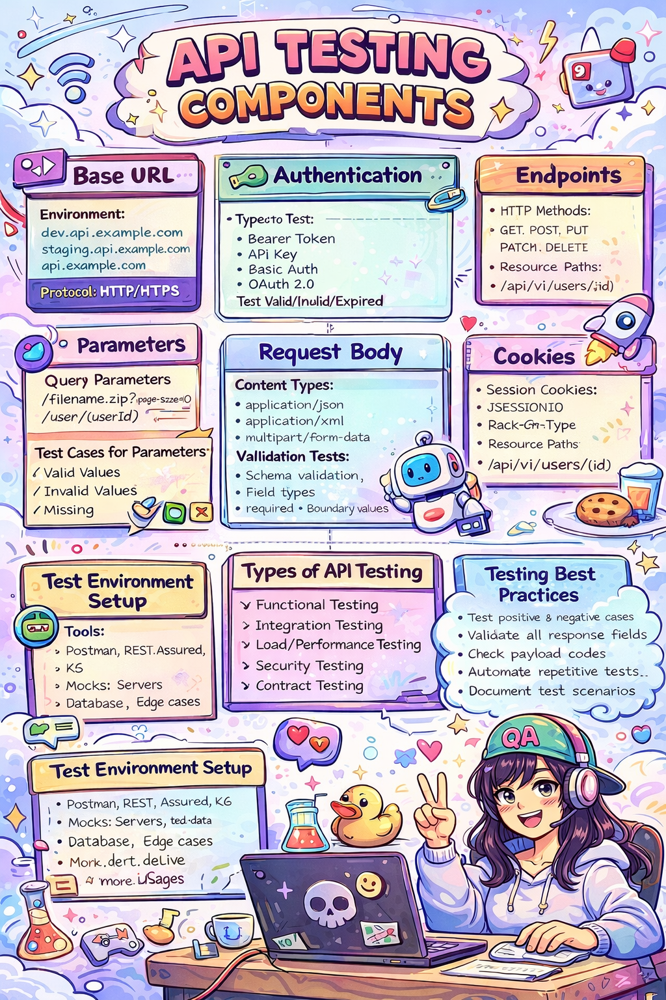

  

<h2 align="center">
QA Analyst | Manual & API Testing | AI-Assisted QA
</h2>

API Testing Components.png
# Hi, I'm Mahaya 👋  

### QA Analyst | 5+ Years in Manual & API Testing | AI-Assisted QA Practitioner

I am a Quality Assurance Analyst with over 5 years of hands-on experience in manual testing across web, mobile, and digital platforms.  
My core strength lies in understanding application behaviour, validating business logic, and ensuring quality beyond surface-level testing.

In recent years, I have strengthened my API testing skills using Postman and adopted AI-assisted techniques to improve test coverage, edge-case identification, and documentation quality.

I use AI as a **supporting tool**, not a replacement for QA thinking — applying it to enhance test design, analyze API behaviour, and refine bug reports while keeping final decisions manual and experience-driven.

---
## 🧩 How I Think About API Testing

A visual representation of my API testing approach —  
covering authentication, headers, parameters, responses, and edge cases.

## 🤖 AI in My QA Workflow (Practical & Responsible)

With 5+ years of manual testing experience, I integrate AI into my QA workflow to work smarter and deeper, not faster blindly.

I use AI to:
- Expand manual test case coverage with additional edge and negative scenarios
- Review API request/response structures for missing validations
- Improve clarity and structure of bug reports and documentation
- Support root-cause analysis by separating API, UI, and logic-level issues

My experience helps me filter AI suggestions critically, ensuring only realistic and relevant test scenarios are executed.

## 📂 Featured Projects
- 🔗 Postman API Testing Project  
  [https://github.com/Mahaya07/postman-api-testing]

  ## 🧩 Core Skills Snapshot

- Manual Testing (Web, Mobile, Content QA)
- API Testing (Postman – GET, POST, Negative Testing)
- Test Case Design & Bug Reporting
- AI-Assisted QA (Test Design, API Analysis, Documentation)
- Agile / Scrum | Jira | GitHub
  
## 🧰 Tools & Technologies

  
  
  
  
  

